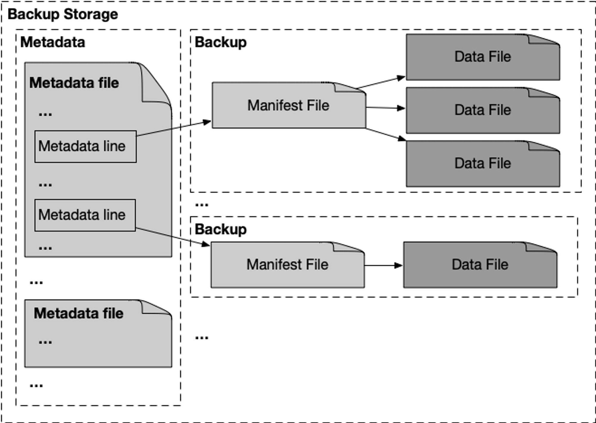

# Bootstrap from a Backup

This document describes how to bootstrap an Aptos node using a backup. This can be done on all node types, including
validators, VFNs and PFNs. Bootstrapping using a backup helps node operators achieve two goals:

1. Quickly bootstrap a database to start a new or failed node.
1. Efficiently recover data from any specific period in the blockchain's history (e.g., from genesis to a target version).

To achieve these goals, the Aptos database restore tool lets you use existing [public backup files](#public-backup-files) to restore
the database of a node. This includes the transaction history containing events, write sets, and key-value pairs. Using
the tool, you can restore transactions from any historical range, or restore the database to the latest version in the
backup. The public backup files are backed by cryptographic proofs and stored on both AWS and Google Cloud for easy
access.

## Public backup files

Aptos Labs maintains a few publicly accessible database backups by continuously querying a PFN and storing the backup
data in remote storage, such as Amazon S3 or Google Cloud Storage. The links to this backup data can be seen below:

|         | AWS Backup Data                                                                       | Google Cloud Backup Data                                                        |
| ------- | ------------------------------------------------------------------------------------- | ------------------------------------------------------------------------------- |
| Testnet | Discontinued                                                                          | https://github.com/aptos-labs/aptos-networks/blob/main/testnet/backups/gcs.yaml |
| Mainnet | https://github.com/aptos-labs/aptos-networks/blob/main/mainnet/backups/s3-public.yaml | https://github.com/aptos-labs/aptos-networks/blob/main/mainnet/backups/gcs.yaml |

:::tip
Backups are only created for `testnet` and `mainnet`. Given that `devnet` is wiped frequently, it is not useful to maintain backups for it.
:::

The backup files consist of three types of data that can be used to reconstruct the blockchain DB:

- `epoch_ending` – This contains the ledger_info at the ending block of each epoch since the genesis. This data can be used to prove the epoch's provenance from the genesis and validator set of each epoch.
- `state_snapshot` – This contains a snapshot of the blockchain's state Merkle tree (SMT) and key values at a certain version.
- `transaction` – This contains the raw transaction metadata, payload, the executed outputs of the transaction after VM, and the cryptographic proofs of the transaction in the ledger history.

Each type of data in the backup storage is organized as follows:

- The metadata file in the metadata folder contains the range of each backup and the relative path to the backup folder.
- The backup contains a manifest file and all the actual chunked data files.

See the diagram below for a visual representation of the backup data structure:

<!--  -->


## Restore an Aptos DB

The [Aptos CLI](../../tools/aptos-cli/use-cli/use-aptos-cli.md) supports two kinds of restore operations for Aptos nodes:

1. Recreating a database with a minimal transaction history at a user-specified transaction version (or the latest version offered by the backup).
2. Restoring the database over a specific period. In addition to the above, this option ensures that the recreated database carries the ledger history of the user-designated version range.

:::tip
Aptos CLI 1.0.14 or newer is needed to perform these operations. Additionally, depending on whether you use AWS or
Google Cloud, install [AWS CLI](https://docs.aws.amazon.com/cli/latest/userguide/getting-started-install.html) or [gsutil](https://cloud.google.com/storage/docs/gsutil_install).
:::

The sections below provide examples of how to use the Aptos CLI to restore a database from a backup.

### Bootstrap to the latest version

The `aptos node bootstrap-db` command can quickly restore a database from the latest snapshot back to a target version,
but it does not restore the transaction history prior to the target version.

Use the following options to run the command:

- `target-version` – The sync will begin from this period onwards in the transaction history (towards the latest version).
- `command-adapter-config` – The path to one of the [YAML configuration files](#public-backup-files) that specifies the location of the public backup files and commands used by our backup and restore tool to interact with the remote storage.
- `target-db-dir` – The target DB path to write the restored database.

Example command:

```bash
aptos node bootstrap-db \
    --target-version 500000000 \
    --command-adapter-config /path/to/s3-public.yaml \
    --target-db-dir /path/to/local/db
```

### Restore over a specific time period

The `aptos node bootstrap-db` command can restore the transaction history within a specified period, along with the state Merkle tree at the target version.

Use the following options to run the command:

- `ledger-history-start-version` – The sync will begin from this period onwards in the transaction history (towards the target version).
- `target-version` – The sync will end at this period in the transaction history.
- `command-adapter-config` – The path to one of the [YAML configuration files](#public-backup-files) that specifies the location of the public backup files and commands used by our backup and restore tool to interact with the remote storage.
- `target-db-dir` – The target DB path to write the restored database.

Example command:

```bash
aptos node bootstrap-db \
    --ledger-history-start-version 150000000 \
    --target-version 155000000
    --command-adapter-config /path/to/s3-public.yaml \
    --target-db-dir /path/to/local/db
```

### Restore a full history from genesis

To restore an Aptos node with the full history from genesis, set `ledger-history-start-version` to 0 and
disable the pruner by following the instructions in the [disabling the ledger pruner](../../guides/data-pruning.md) section before
starting the node. Note: performing a full history restore requires a significant amount of resources and time.
See the resource requirements below.

- **Open File Limit**: Set the open file limit to 10K, e.g., using `ulimit -n 10000`.
- **Testnet**: If you are restoring a testnet node, you will need the following resources:
  - **Disk**: 1.5TB
  - **RAM**: 32GB
- **Mainnet**: If you are restoring a mainnet node, you will need the following resources:
  - **Disk**: 1TB
  - **RAM**: 32GB

Example command:

```bash
aptos node bootstrap-db \
--ledger-history-start-version 0 \
--target-version use_the_largest_version_in_backup \
--command-adapter-config /path/to/s3-public.yaml \
--target-db-dir /path/to/local/db
```

:::tip
If you don't specify the target_version (via `--target-version`), the tool will use the latest version in the backup as the target version.
:::
